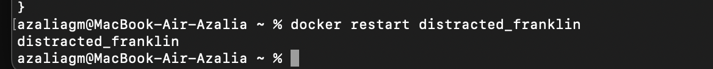
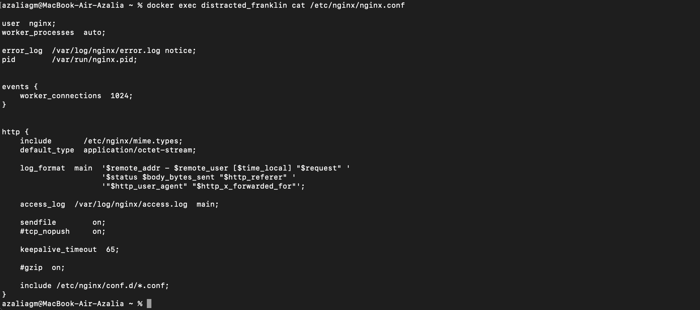
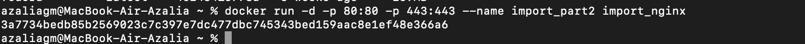
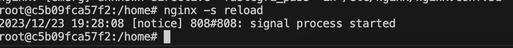
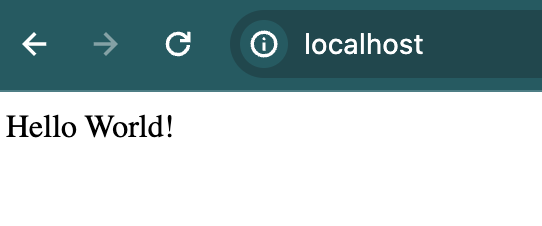
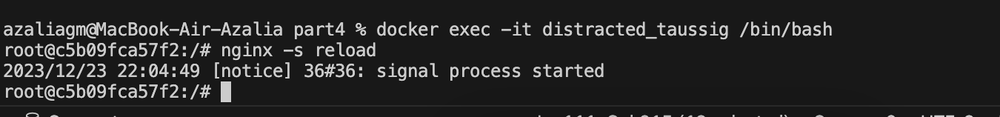

## Part 1. Готовый докер

##### Взять официальный докер образ с **nginx** и выкачать его при помощи `docker pull`

##### Проверяем наличие докер образа через `docker images`

##### Запустить докер образ через `docker run -d [image_id|repository]`

##### Проверить, что образ запустился через `docker ps`

##### Посмотреть информацию о контейнере через `docker inspect [container_id|container_name]`
- Полученная информация:

##### По выводу команды определить и поместить в отчёт размер контейнера, список замапленных портов и ip контейнера
- размер контейнера:

- список замапленных портов:

- ip контейнера:

##### Остановить докер образ через `docker stop [container_id|container_name]`

- Вывод команды `docker stop distracted_franklin`

##### Проверить, что образ остановился через `docker ps`

- Вывод команды `docker ps`

##### Запускаем докер с портами 80 и 443 в контейнере, замапленными на такие же порты на локальной машине, через команду *run* 
- Вывод команды `docker run -d -p 80:80 -p 443:443 nginx`:

##### Проверяем, что в браузере по адресу *localhost:80* доступна стартовая страница **nginx**

##### Перезапустить докер контейнер через `docker restart [container_id|container_name]`

##### Проверяем любым способом, что контейнер запустился
- Вывод команды `docker ps`:

## Part 2. Операции с контейнером

##### Прочитать конфигурационный файл *nginx.conf* внутри докер контейнера через команду *exec*
- Вывод команды `docker exec distracted_franklin cat /etc/nginx/nginx.conf`

##### Создать на локальной машине файл *nginx.conf* и настроить в нем по пути */status* отдачу страницы статуса сервера **nginx**
- Создаем с помощью команды `touch nginx.conf` и прописываем в нем порт 80, также location = /status {stub_status on}; для того, чтобы появилась страница по адресу localhost/status с отображением статуса
[nginx.conf](./image/16.png)
##### Скопировать созданный файл *nginx.conf* внутрь докер образа через команду `docker cp`

##### Перезапустить **nginx** внутри докер образа через команду *exec*
- Вывод команды `docker exec distracted_franklin nginx -s reload`

##### Проверить, что по адресу *localhost:80/status* отдается страничка со статусом сервера **nginx**

##### Экспортировать контейнер в файл *container.tar* через команду *export* и остановить контейнер

##### Удалить образ через `docker rmi [image_id|repository]`, не удаляя перед этим контейнеры

##### Удалить остановленный контейнер

##### Импортировать контейнер обратно через команду *import*
- вывод команды `sudo docker import -c 'cmd ["nginx", "-g", "daemon off;"]' -c 'ENTRYPOINT ["/docker-entrypoint.sh"]' container.tar import_nginx`:

##### Запустить импортированный контейнер

##### Проверить, что по адресу *localhost:80/status* отдается страничка со статусом сервера **nginx**

## Part 3. Мини веб-сервер

##### Написать мини сервер на **C** и **FastCgi**, который будет возвращать простейшую страничку с надписью `Hello World!`
##### Для этого необходимо создать .c файл, в котором будет описана логика сервера (в нашем случае - вывод сообщения Hello World!), а также конфиг nginx.conf, который будет проксировать все запросы с порта 81 на порт 127.0.0.1:8080

##### Теперь выкачаем новый docker-образ и на его основе запустим новый контейнер `docker run -d -p 81:81 nginx`

##### Скопировать созданные файлы `docker cp nginx.conf distracted_taussig:/etc/nginx/` `docker cp server.c distracted_taussig:/home`:

##### Для того чтобы запустить написанный мини сервер, необходимо установить требуемые утилиты для запуска мини веб-сервера на FastCGI, в частности spawn-fcgi и libfcgi-dev `apt-get install -y spawn-fcgi libfcgi-dev`

##### скомпилируем и запустим наш мини веб-сервер через команду spawn-fcgi на порту 8080

##### Проверить, что в браузере по *localhost:81* отдается написанная вами страничка

## Part 4. Свой докер

#### Написать свой докер образ, который:
##### 1) собирает исходники мини сервера на FastCgi из [Части 3] 
##### 2) запускает его на 8080 порту
##### 3) копирует внутрь образа написанный *./nginx/nginx.conf*
##### 4) запускает **nginx**.

##### Собрать написанный докер образ через `docker build` при этом указав имя и тег
- Вывод команды `docker build -t distracted_taussig:1.0 .`

##### Проверить через `docker images`, что все собралось корректно

##### Запустить собранный докер образ с маппингом 81 порта на 80 на локальной машине и маппингом папки *./nginx* внутрь контейнера по адресу, где лежат конфигурационные файлы **nginx**'а `docker run -it -p 80:81 -v /Users/azaliagm/DO5_SimpleDocker-1/src/part4/nginx.conf:/etc/nginx/nginx.conf -d distracted_taussig:1.0 bash`

##### Проверим, что по localhost:80 доступна страничка написанного мини сервера

##### Дописать в *./nginx/nginx.conf* проксирование странички */status*, по которой надо отдавать статус сервера **nginx**

##### Перезапустить докер образ
- используем команды  и `docker exec -it distracted_taussig /bin/bash` `nginx -s reload`

*Если всё сделано верно, то, после сохранения файла и перезапуска контейнера, конфигурационный файл внутри докер образа должен обновиться самостоятельно без лишних действий*
##### Проверяем, что теперь по *localhost:80/status* отдается страничка со статусом **nginx**

## Part 5. **Dockle**

##### Просканировать образ из предыдущего задания через `dockle [image_id|repository]`
- Вывод команды: 

##### Исправляем образ так, чтобы при проверке через dockle не было ошибок и предупреждений

- Снова просканируем образ

- Команда  `dockle -ak NGINX_GPGKEY -i CIS-DI-0010 distracted_taussig:1.0` выполняет проверку Dockerfile на соответствие определенному аспекту безопасности, связанному с использованием переменной окружения NGINX_GPGKEY.
## Part 6. Базовый **Docker Compose**
##### Написать файл *docker-compose.yml*, с помощью которого:
##### 1) Поднять докер контейнер из [Части 5](#part-5-инструмент-dockle) _(он должен работать в локальной сети, т.е. не нужно использовать инструкцию **EXPOSE** и мапить порты на локальную машину)_
##### 2) Поднять докер контейнер с **nginx**, который будет проксировать все запросы с 8080 порта на 81 порт первого контейнера
##### Замапить 8080 порт второго контейнера на 80 порт локальной машины

##### Остановить все запущенные контейнеры

##### Собрать и запустить проект с помощью команд `docker-compose build` и `docker-compose up`
- `docker-compose build`

- `docker-compose up`

##### Проверить, что в браузере по *localhost:80* отдается написанная вами страничка, как и ранее

